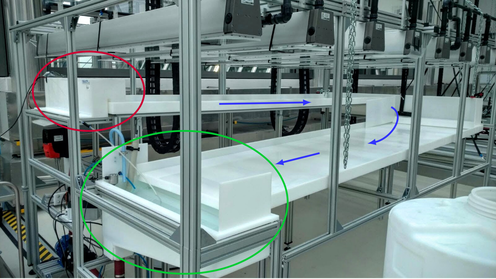
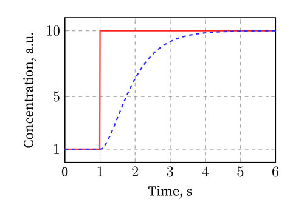

# Outline

* Introduction
* Objectives
* Design
* Results
* Outlook

# Introduction



# Objectives

enable experiments to validate simulation

* add saltwater impulse to freshwater stream
* measure changes in salinity over time
    * at multiple points
    * fast



---------------

## Requirements

|Nr. | Requirement                                | Verification     |
|----|--------------------------------------------|------------------|
|1   | spacial resolution: 10mm                   | Test, Inspection |
|2   | sensitivity: 0.1%                          | Test             |
|3   | range: 0 to 5%                             | Test             |
|4   | cost per sensor: < €25                     | Analysis         |
|5   | deployable in the algae reactor            | Demonstr.        |
|6   | easy to use                                | Test, Review     |


# Design

describe Design

---------------

more Design

```python
import main

print('test')
```

# Results

plots
demo

# Outlook

new stuff
